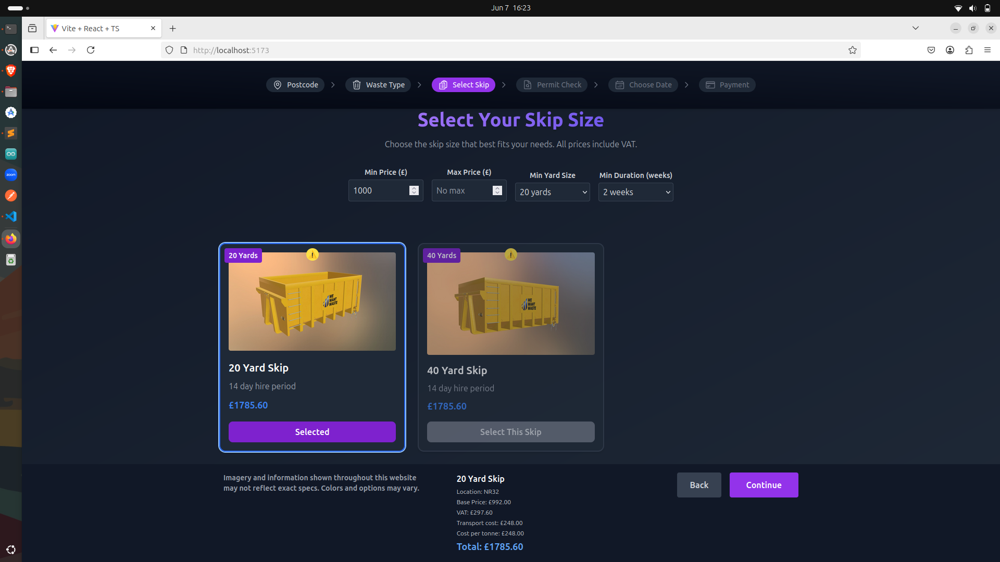

#  Skip Selection Web Application

> A modern, responsive redesign of the **"Choose Your Skip Size"** page from [WeWantWaste](https://wewantwaste.co.uk/), with improved UX and clean React architecture.

---
## 🌍 Live Demo

👉 [View Live Site](https://redesign-drab.vercel.app/)

---

##  Overview

This project reimagines the user interface and user experience of the skip size selection page. It retains the original functionality, while offering an optimized, mobile-first design built with:

*  **React**
*  **Tailwind CSS**
*  **TypeScript**
*  **Vite**
*  **Supabase** (image hosting)

It consumes real-time data from an API and allows users to filter and select skip options with detailed price breakdowns.

---

##  Features  | Improvements

* **Improved Breadcrumb Navigation**:
  * Enhanced responsiveness for better user experience.

* **Dynamic Filtering**:
  * Filter by price range, yard size, and hire duration (weeks).

* **Hover Effects for Cards**:
  * Added zoom effect on hover for better interactivity.

* **Responsive Layout**:
  * Optimized for both mobile and desktop devices.

* **Sticky Action Bar**:
  * Displays summary of the selected item.

* **Fallback UI**:
  * Provides a message or placeholder when no results match the filters.

* **Supabase Integration**:
  * Used for hosting skip images seamlessly. i noticed this is what was used in th template from the image urls 

---

## 🧠 Hooks

### `useFetchSkipOptions.ts`

Custom hook that fetches live skip data from the API:

```ts
const apiUrl = `${import.meta.env.VITE_API_URL}?postcode=NR32&area=Lowestoft`;
```

> 💡 **Note**:
> The `postcode` and `area` parameters are currently **hardcoded** to simulate a focused redesign of a single page (`/choose-your-skip-size`).
>
> In a real-world implementation, these values would come from user input or navigation state (e.g., React Router or context). This decision kept the project lean and on-scope as per the challenge brief.

The hook returns:

* `skipOptions`: parsed array of options
* `loading`: boolean loading state
* `error`: error message if fetch fails

---

## 📁 Project Structure

```bash
src/
├── assets/                # Contains images and screenshot used in the project
├── components/            # Houses reusable UI components like Header, HeroSection, SkipOptionCard, etc.
├── hooks/                 # Custom React hooks for managing state and fetching data
├── pages/                 # Page-level components, such as SkipSelectionPage
├── types/                 # TypeScript types for defining data structures
├── utils/                 # Utility functions, including fetchImages.ts for image handling and supabaseClient.ts for Supabase integration
├── App.tsx                # Root component of the application
├── main.tsx               # Entry point of the React application
└── index.css              # Global CSS styles
```

---

### Supabase Integration

Supabase was chosen for image hosting because the original template images were sourced from Supabase. To maintain consistency, I downloaded the same images and uploaded them to my own Supabase bucket. This allows seamless association of API data with corresponding images. The `utils/fetchImages.ts` file handles fetching these images and mapping them to skip sizes dynamically.

---

## ⚙️ Environment Variables

Used for API and Supabase configuration:

```bash
VITE_API_URL=https://app.wewantwaste.co.uk/api/skips/by-location
VITE_SUPABASE_URL=https://url.supabase.co
VITE_SUPABASE_ANON_KEY=<your-anon-key>
```

---

## 🖼 Screenshot Preview

> 📷 `./src/assets/screenshot.png`

The screenshot preview helps visualize the clean UI redesign:



---

## 🔌 API Integration

Skip options are dynamically fetched from:

```
GET https://app.wewantwaste.co.uk/api/skips/by-location?postcode=NR32&area=Lowestoft
```

The returned data includes:

* Size (in yards)
* Price breakdown (VAT, transport, tonne rate)
* Duration
* Suitability flags
* Image URL (from Supabase)

---

## 🚀 Getting Started

### 1. Clone the Repo

```bash
git clone https://github.com/dev-sheikh-ali/redesign.git
cd redesign
```

### 2. Install Dependencies

```bash
npm install
```

### 3. Start Dev Server

```bash
npm run dev
```

Visit `http://localhost:PORT`.

---

## 🏗️ Production Build

```bash
npm run build
```

Build output is saved in `/dist`.